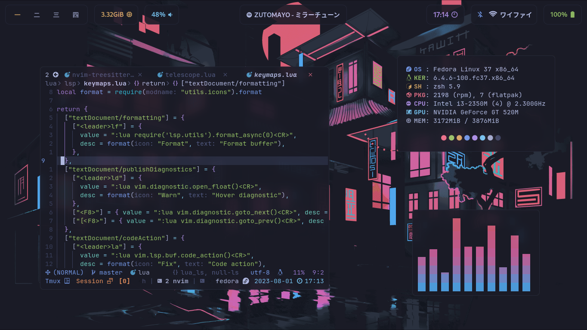

# dotfiles

This repository contains my linux dotfiles, you can find my neovim dotfiles [here](https://github.com/luckasRanarison/nvimrc).

## Preview

(Potato laptop)

## Contents
- hyprland
- zsh
- tmux
- waybar
- rofi
- dunst
